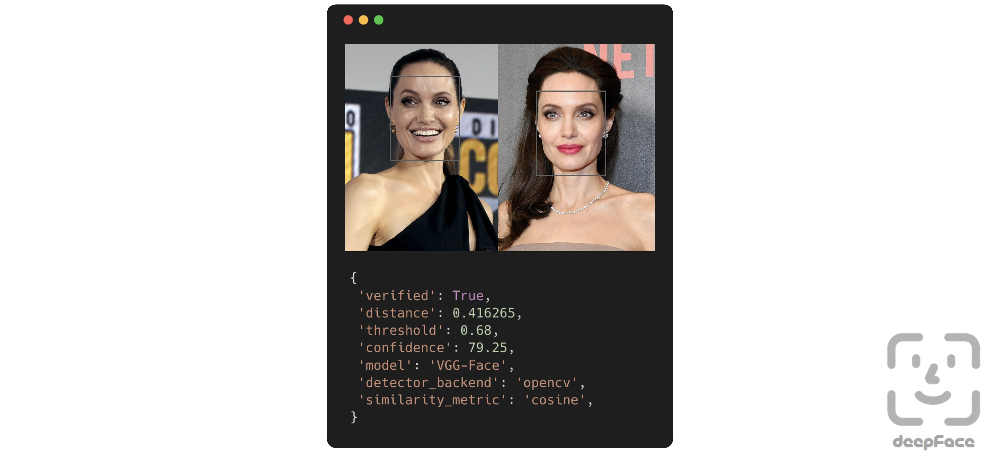

# Face Verification via Cosine Similarity in [Deepface](https://github.com/serengil/deepface)

DeepFace is a lightweight face recognition and facial attribute analysis (age, gender, emotion and race) framework for python. It is a hybrid face recognition framework wrapping state-of-the-art models: VGG-Face, FaceNet, OpenFace, DeepFace, DeepID, **ArcFace**, Dlib, SFace, GhostFaceNet, Buffalo_L.

[Experiments](https://github.com/serengil/deepface/tree/master/benchmarks) show that human beings have 97.53% accuracy on facial recognition tasks whereas those models already reached and passed that accuracy level.

## Face Verification
This function determines whether two facial images belong to the same person or to different individuals. The function returns a dictionary, where the key of interest is verified: True indicates the images are of the same person, while False means they are of different people.

<p align="center">

</p>

The code used, `DeepFace_eval.py`, receives two folders: one for the original videos and another for its anonymised counterpart. Each video will be sampled at the start, middle and end of the frame with their average taken and used as the final verdict.

Raw results will be saved by default at: `./identity_verification_results.csv`

## Installation 
1. Install library
```shell
pip install deepface
```

2. Clone this source code
 ```shell
  git clone https://github.com/Forensic-Face-Anon/CosineSimilarity.git
  ```

3. Inside the project root, upload the **videos** for both anonymised and original.
   
4. Update the configuration settings in `DeepFace_eval.py` according to your file directory
```code
ORIGINAL_DIR = "./driving/" # original videos folder
ANON_DIR = "./output_mask/" # anonymised videos folder
OUTPUT_CSV = "./identity_verification_results.csv"
```
5. Run the code
 ```shell
  python DeepFace_eval.py
  ```

## Acknowledgements
```
@article{serengil2026boosted,
  title     =  {Boosted LightFace: A Hybrid DNN and GBM Model for Boosted Facial Recognition},
  author    =  {Serengil, Sefik Ilkin and Ozpinar, Alper},
  journal   =  {Gazi University Journal of Science},
  volume    =  {39},
  number    =  {1},
  pages     =  {452-466},
  year      =  {2026},
  doi       =  {10.35378/gujs.1794891},
  url       =  {https://dergipark.org.tr/en/pub/gujs/article/1794891},
  publisher =  {Gazi University}
}
```
